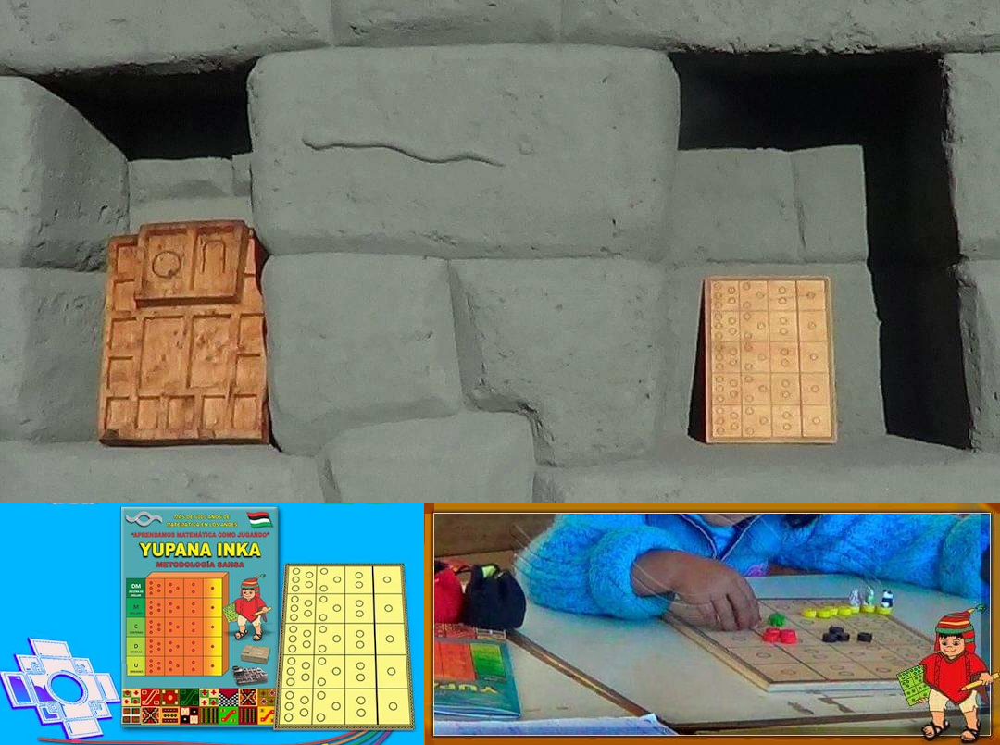
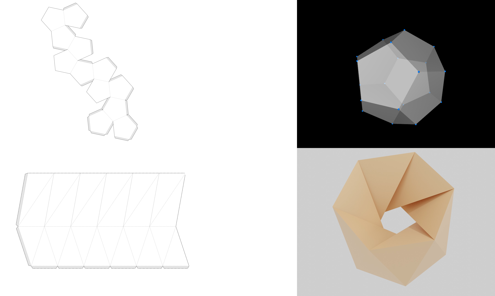
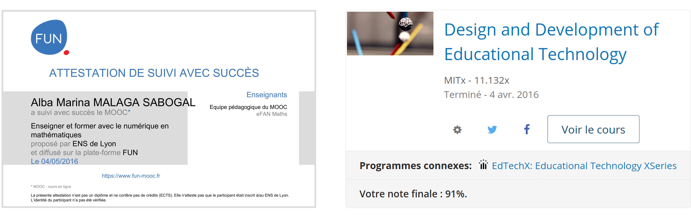
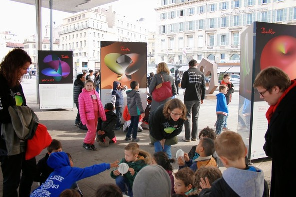
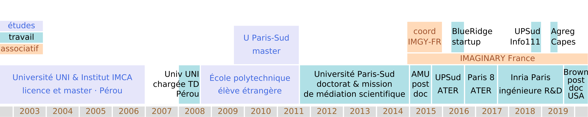

# Intégration à l'ADEF

EAST: Rôle des artefacts dans l'efficacité de l'éducation scientifique et technologique

Axe thématique «outils et instruments pour l’enseignement».

Quelques projets de recherche:

-------------- ------------------------------
Primaire       Nombres avec la yupana inca
Secondaire     Géométrie avec l'impression 3D
Supérieur      Le raisonnement mathématique avec L$∃∀$N
-------------- --------------------------

----------------------------------------

## Yupana Inca

\centering{width=75%}\par

\centering Expérience d'initiation à l'addition et à la multiplication\par

----------------------------------------

## L'impression 3D

\centering{width=75%}\par

\centering Vecteur de compréhension de la géométrie.\par

----------------------------------------

## L'impression 3D

\centering  Diverses techniques de représentation de polyèdres\par

----------------------------------------

## Le raisonnement mathématique avec L$∃∀$N

L$∃∀$N: un assistant de preuves (prononcer «linne»)

Utilisé en L1 math-info
[cours «Introduction aux mathématiques formalisées»](https://www.math.u-psud.fr/~pmassot/enseignement/math114/) 
par Patrick Massot,
prof d'université en mathématiques à Orsay

----------------------------------------

## Mes compétences et les thématiques de l'ADEF

\begin{columns}[onlytextwidth,T]
  \begin{column}{.7\linewidth}
    \begin{itemize}
    \item Je suis une «maker».

    \item Je crée et j'étudie des objets mathématiques. 

    \item Ces objets deviennent des instruments dans des situations d'enseignement-apprentissage. 

    \item Des instruments générateurs de projets de recherche en didactique.

    \item L'équipe qui me correspond le mieux à l'ADEF est donc l'équipe EAST.
    \end{itemize}
  \end{column}
  \begin{column}{.25\linewidth}
    \includegraphics[angle=270,width=\linewidth]{img/alba-dini}
  \end{column}
\end{columns}

# Intégration à l'Inspé

## Motivée par les questions éducatives

- suivi deux MOOC sur l'éducation
    - eFan Maths session 2 (ESPÉ de Lyon et autres partenaires)
        - projet «Objets mathématiques imprimés en 3D»
    - Design and Development of Educational Technology (MIT)
        - projet «Plagiarism prevention»
        

- interactions avec des enseignants:  
    - salons et festivals
    - fêtes de la science
    - visites en classes
    - et aussi dans les MOOC

----------------------------------------

## Formation des professeurs des écoles

Trois étapes (programmes sur Eduscol):

- [cycle 1](https://eduscol.education.fr/pid33040/programme-ressources-et-evaluation.html) -- apprentissages premiers
- [cycle 2](https://eduscol.education.fr/pid34139/cycle-2-ecole-elementaire.html) --  apprentissages fondamentaux
- [cycle 3](https://eduscol.education.fr/pid34150/cycle-3-ecole-elementaire-college.html) ($⅔$) -- consolidation

Formation professionnalisante donc équilibre entre:

- besoins du métier
- approche scientifique
- préparation aux concours

Formation interdisciplinaire donc équilibre entre:

- s'assurer d'une maîtrise des mathématiques fondamentales
- former à un enseignement des mathématiques placées dans le monde

----------------------------------------

## Formation des professeurs certifiés

Collège:
- [cycle 3](https://eduscol.education.fr/pid34150/cycle-3-ecole-elementaire-college.html) ($⅓$) -- consolidation
- [cycle 4](https://eduscol.education.fr/pid34185/cycle-4-college.html) -- approfondissements

[Lycée général et technologique](https://eduscol.education.fr/pid38708/lycee-general-et-technologique-bac-2021.html)

Formation professionnalisante donc équilibre entre:

- besoins du métier
- approche scientifique
- préparation aux concours

Formation interdisciplinaire donc équilibre entre:

- s'assurer d'une maîtrise des mathématiques fondamentales
- former à un enseignement des mathématiques qui aident à comprendre le monde

----------------------------------------

## Mise en relation entre mon parcours et la formation des enseignants

|Mon parcours |Applications à la formation des enseignants            |
|----------------|-------------------------------------------------------|
|Impression 3D|Usages en classe de la conception et de l'impression 3D|
|Accessibilité|Créer des documents accessibles pour les élèves        |
|             |Prise en compte de la fracture numérique               |
|Esprit «maker» |L'armoire de l'enseignant de mathématiques             |
|Médiation scientifique|Informations sur les événements, le milieu, les ressources,...|

# Propositions pour SFERE-Provence

## Projets de recherche

Les projets de recherche déjà présentés:

-------------- ------------------------------
Primaire       Nombres avec la yupana inca
Secondaire     Géométrie avec l'impression 3D
Supérieur      Le raisonnement mathématique avec L$∃∀$N
-------------- --------------------------

pourraient bénéficier d'une collaboration dans Sfere au-delà de l'ADEF, par exemple avec l'I2M et l'IREM de Marseille.

----------------------------------------

## Colloques et rencontres

### Expérience

2015: Médiation scientifique et plateformes de partage\
2020: Outils logiciels pour les mathématiques et l'illustration

### Propositions

- Rencontre interrogeant la médiation, ses usages et ses effets
    - suite du projet 1.3. cartographie de la relation entre l'éducation, la médiation, les expériences artistique et scientifique et le développement de la personne, 2018
- Ateliers Software Carpentry
    - formation à des compétences informatiques pour la recherche.

----------------------------------------

## Médiation scientifique

Une autre exposition Imaginary à Marseille\
avec une approche de recherche didactique.

# Questions?

|                                                   |                                                |                                                        |
|-------------------------------------------|----------------------------------------|-----------------------------------------|
|continuité et ouverture dans la recherche|un vrai souci de l'accessibilité  |fibre «maker»|
|intérêt en médiation scientifique|enseignement dans le respect|parcours polyvalent|

J'ai à cœur de m'intégrer dans la recherche à l'ADEF, dans l'enseignement à l'Inspé et dans le bain interdisciplinaire de Sfere-Provence.

{width=100%}
